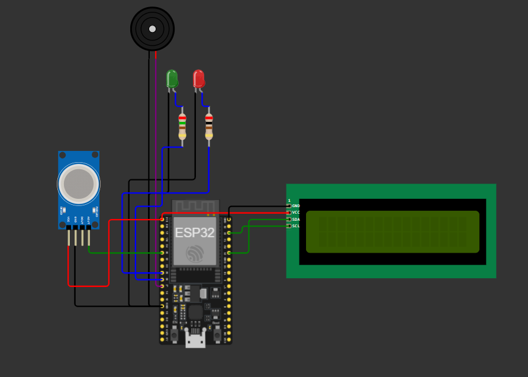
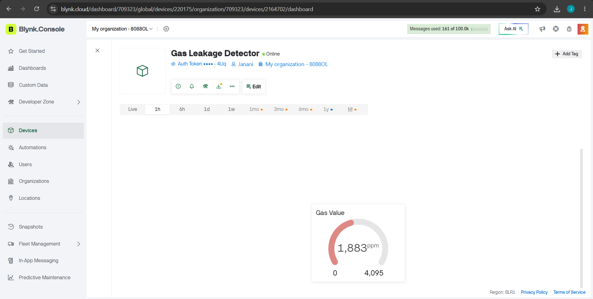

# Gas Leakage Detection System

## Aim
To develop an IoT-based gas leakage detection and alert system using ESP32, MQ gas sensor, Blynk Cloud, LCD, LEDs, and buzzer.

## Wokwi Simulation
Project Link:
https://wokwi.com/projects/466345144357183489

## Problem Statement

Gas leakage is a serious safety concern in homes, industries, laboratories, and commercial buildings. Undetected gas leaks can lead to fire accidents, explosions, health hazards, and environmental damage. Traditional monitoring methods often require manual inspection, which may not provide immediate alerts during emergencies.

## Scope of the Solution

The proposed Gas Leakage Detection and Alert System is designed to provide continuous monitoring of gas concentration levels in an enclosed environment. The system uses an MQ gas sensor to detect the presence of harmful gases and an ESP32 microcontroller to process sensor data.

The solution includes the following functionalities:

- Continuous monitoring of gas levels in real time.
- Display of gas sensor readings on a 16x2 LCD display.
- Green LED indication during normal conditions.
- Red LED indication when gas concentration exceeds the safety threshold.
- Buzzer activation to provide an audible warning during gas leakage.
- Real-time cloud connectivity using the Blynk platform.
- Instant alert notifications through Blynk when a gas leak is detected.
- Remote monitoring of gas levels through the Blynk dashboard.

This system can be further enhanced in the future by integrating SMS alerts, automatic exhaust fan control, emergency shut-off mechanisms, and advanced gas sensors for industrial applications.

## Objective

The objective of this project is to develop an IoT-based Gas Leakage Detection and Alert System using an ESP32 microcontroller and an MQ gas sensor. The system continuously monitors gas concentration levels in the environment and detects any abnormal increase beyond a predefined threshold. When a gas leak is detected, the system activates local warning devices such as a buzzer and LED indicators while simultaneously sending real-time alerts through the Blynk Cloud platform. This helps ensure quick response and improves overall safety.

## Required Components

### Hardware
- ESP32 Development Board
- MQ Gas Sensor
- 16x2 LCD with I2C Module
- Red LED
- Green LED
- Buzzer
- Connecting Wires

### Software
- Arduino IDE
- Wokwi Simulator
- Blynk IoT Platform
- GitHub

### Cloud Environment
- Blynk Cloud

## Features

- Real-time gas monitoring
- LCD status display
- Visual indication using LEDs
- Audible alarm using buzzer
- Cloud notification through Blynk
- Email alert when gas leakage is detected

## Simulated Circuit

## Blynk Dashboard

